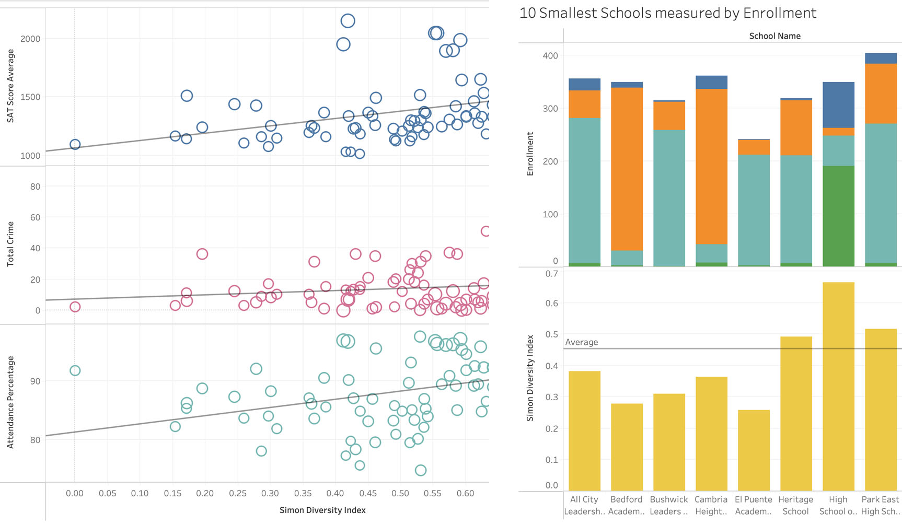
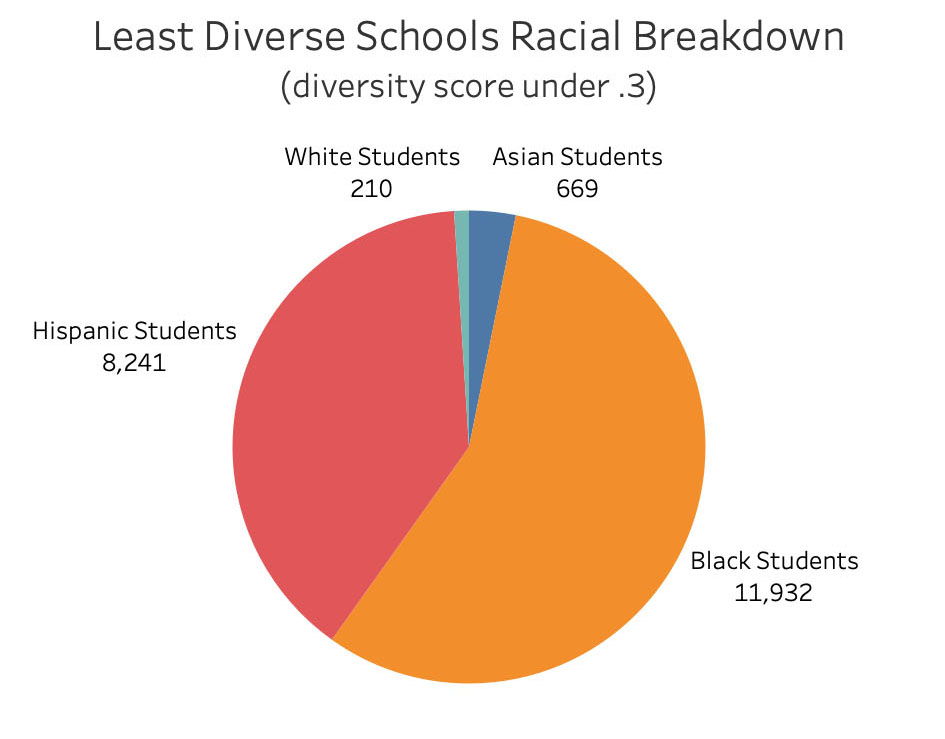

# Diversity in NYC Schools

## Description 

Explores diversity and possible correlations in the New York City Public school system. I calculated diversity by using <b>Simpson's Diversity Index</b>, which results in a rating between 0 and 1.

High scores (close to 1) indicate high diversity.
Low scores (close to 0) indicate low diversity.

## Table of Contents
* [Run](#Results)
* [Tools](#Tools)
* [Data](#Data)
* [Graphs](#Graphs)
* [Contact](#Contact)

## Run

The below link takes you to the resulting dashboard on Tableau Public:

[Diversity in NYC Schools - Tableau Story](https://public.tableau.com/app/profile/julia4245/viz/NYC_School_Stats/NYC_Diversity_Story?publish=yes)

## Tools

Python, Jupyter Notebook, SQLAlchemy, pgAdmin, Tableau

  
## Graphs

Daily cases and deaths for entire pandemic. User can zoom in as well as see daily tallies by moving their cursor over the graph.  

Shows the risk level, trend, and ICU capacity for the area presently. (I calculate trend by taking the total confirmed cases of the last seven days and comparing it the previous week.)

## Data

This app pulls data the following data from the [COVID ACT NOW API](https://apidocs.covidactnow.org/).

<b>New Cases:</b>  New confirmed or suspected cases. 
<b>New Deaths:</b>  New deaths since previous report with erratic values removed by outlier detection. 
<b>Total Cases:</b>  Cumulative confirmed or suspected cases. 
<b>Total Deaths:</b>  Cumulative deaths that are suspected or confirmed to have been caused by COVID-19. 
<b>Fully Vaccinated:</b>  Total number of people completing vaccination - currently those completing their second shot. 
<b>Partially Vaccinated:</b>  Ratio of population that has initiated vaccination. 
<b>Risk Level:</b>  The overall risk level is based on caseDensity, testPositivityRatio, and infectionRate. 
<b>New Cases Trend:</b>  The increase or decrease of newly confirmed cases for state or county as compared to the previous week. 
<b>Icu Bed Capacity:</b>  Information about ICU bed utilization details. 

## Contact

Feel free to contact me with examples or any questions via the information below:

GitHub: [@julia-claira](https://api.github.com/users/julia-claira)

Email: julia-claira@gmail.com
